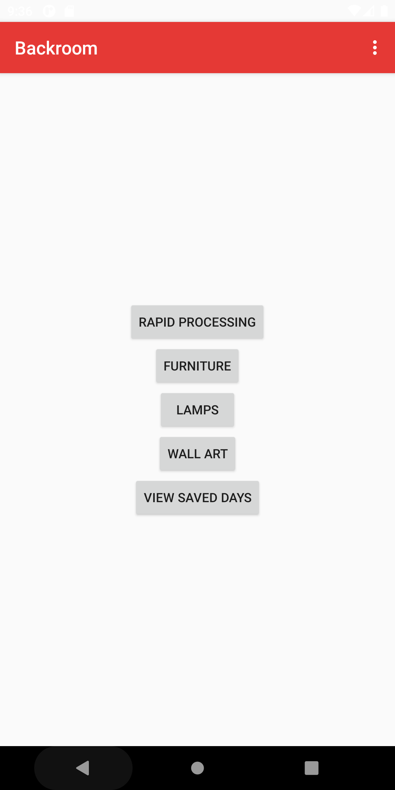
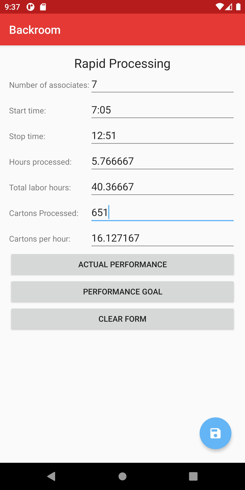
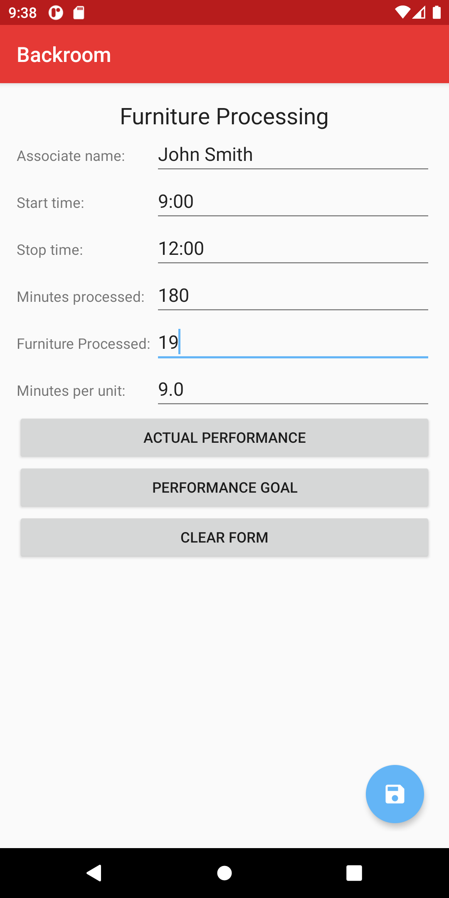

# Backroom
App for calculating backroom metrics - originally created ~2014

I wrote this app while I was working as a stockroom supervisor. This app allowed me to easily calculate the performance of my team
using the metrics provided by my employer. This app also allowed me to calculate our performance goal to easily communicate to my
team before starting our processing for the day.

# Menu

Below is a screenshot of the first screen you see when opening the app. There are options for "rapid processing", "furniture", "lamps",
"wall art", and "view saved days"

- Rapid processing: this measures how we processed the smaller items received on our truck. It is measured as a group metric in
  "cartons per hour" - i.e. how many cartons of small merchandise were processed for every hour of labor spent in the stockroom
  during that process. This was reported to management daily and logged on a chart including labor hours, cartons per hour, start
  and stop times, number of team members processing, and total cartons processed.

- Furniture/lamps/wall art: these types of merchandise were all processed seperately from the smaller cartons and they are each
  measured in "minutes per unit". This was reported to management as a total team number, but logged on an individual basis to measure 
  each team member's productivity and provide appropriate feedback against the company standards.
  
- View saved days: this feature was a WIP when I was promoted out of this position and stopped working on the app. Currently,
  the app does save the data for all of the above by date but I have not yet implemented a way to view that data. The idea was
  to be able to review past days to measure improvement or general reference.
  
# Rapid Processing
  
Below is a screenshot of the calculator for "rapid processing" - the processing of smaller cartons
  

  
- Actual Performance: this is my original purpose for creating this app. If the user enters the number of associates working that day, 
  start/stop times, and actual cartons processed, the app will provide you with:
    - hours spent processing
    - total labor/payroll hours
    - CPH/cartons processed per labor hour
    
  Each of the fields on this screen are numbers which were reported regularly and allowed me to save the time I usually spent calculating
  these numbers at the end of the day. Instead of grabbing a calculator and scratch paper and calculating each step of the way, I was 
  able to simply enter the data and fill out my chart.
  
- Performance Goal: this button allowed me to enter just the number cartons we needed to process that day and the number of people I had 
  working that day, and the app would calculate for me what time we should finish rapid processing based on the cartons-per-hour metric
  provided by the company. This helped me start each day by giving my team a goal time to work towards that day and made it easy to
  know if we were on track to meet our goal while we were processing.
  
- Clear form: resets all fields. Just for convenience
- Save button: I implemented this when "Floating Action Buttons"/FABs were new to Android and I wanted to experiment with adding one.
  This lead to the beginning of the feature to save the data for each day.
  
  # Furniture / Lamps / Wall Art
  
  Below is a screenshot from the furniture processing calculator. The lamp and wall art calculators look identical, but they
  have separate buttons since they were tracked separately and had different goals for minutes-per-unit.
  
  
  
  - Actual Performance / Performance Goal: These buttons do the same thing as the buttons on the Rapid Processing calculator. "Actual 
    Performance" calculates the minutes per unit when the user enters a start/stop time and units processed. "Performance Goal" does
    the opposite by allowing the user to enter a start/stop time and providing a goal for how many units should be processed in that
    time frame. This screen has a "name" field as the metrics were tracked on an individual basis.
